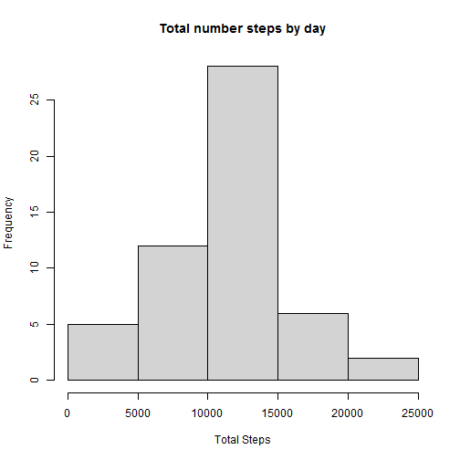
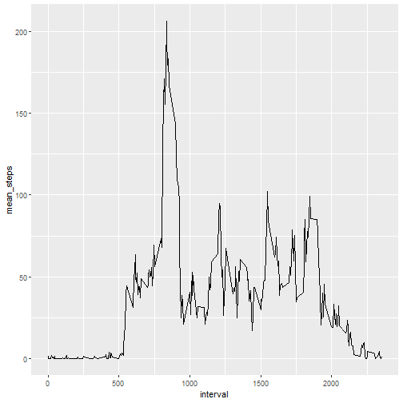
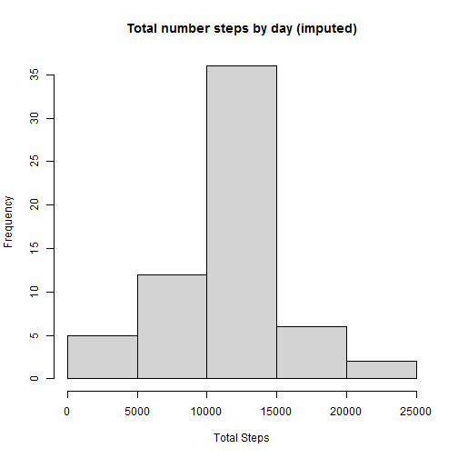
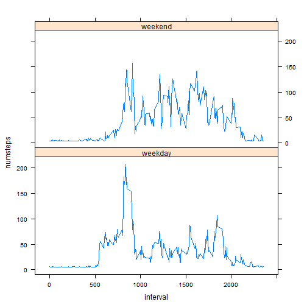

Peer-graded Assignment: Course Project 1
========================================

1. Code for reading in the dataset and/or processing the data


```r
library(lubridate)
dataset <- read.csv("activity.csv")
dataset$date <- ymd(dataset$date)
dataset$weekday <- weekdays(dataset$date)
dataset$daytype <- ifelse(dataset$weekday =="sábado"|dataset$weekday =="domingo","weekend","weekday")
```

2. Histogram of the total number of steps taken each day


```r
library(dplyr)
steps <- tibble(dataset) %>%
         group_by(date) %>%
         summarize(steps = sum(steps))
hist(steps$steps,breaks = 6,xlab = "Total Steps",main = "Total number steps by day")
```



3. Mean number of steps taken each day


```r
mean(steps$steps,na.rm = TRUE)
```

```
## [1] 10766.19
```

3.1 Median number of steps taken each day

```r
median(steps$steps,na.rm = TRUE)
```

```
## [1] 10765
```

4. Time series plot of the average number of steps taken

```r
library(ggplot2)
interval_steps <- tibble(dataset) %>%
                  group_by(interval)%>%
                  summarize(mean_steps = mean(steps,na.rm = TRUE))
g <- ggplot(interval_steps,aes(interval,mean_steps))+geom_line()
print(g)
```



5.The 5-minute interval that, on average, contains the maximum number of steps

```r
interval_steps[which.max(interval_steps$mean_steps),]
```

```
## # A tibble: 1 x 2
##   interval mean_steps
##      <int>      <dbl>
## 1      835       206.
```

6. Code to describe and show a strategy for imputing missing data

```r
imputed <- dataset
imputed$steps[is.na(imputed$steps)] <-mean(imputed$steps,na.rm = TRUE,)
imputed$steps <-round(imputed$steps,digits = 0)
```

7. Histogram of the total number of steps taken each day after missing values are imputed

```r
library(dplyr)
imputed_steps <- tibble(imputed) %>%
  group_by(date) %>%
  summarize(steps = sum(steps))

hist(imputed_steps$steps,breaks = 6,xlab = "Total Steps",main = "Total number steps by day (imputed)")
```



8.  Mean number of steps taken each day (imputed)

```r
mean(imputed_steps$steps,na.rm = TRUE)
```

```
## [1] 10751.74
```

9.  Median number of steps taken each day (imputed)

```r
median(imputed_steps$steps,na.rm = TRUE)
```

```
## [1] 10656
```

10.Panel plot comparing the average number of steps taken per 5-minute interval across weekdays and weekends

```r
weekend_steps <- tibble(imputed) %>%
                 group_by(interval,daytype) %>%
                 summarize(numsteps = mean(steps))
library(lattice)
xyplot(numsteps ~ interval|daytype,weekend_steps,layout =c(1,2),type = "l")
```


